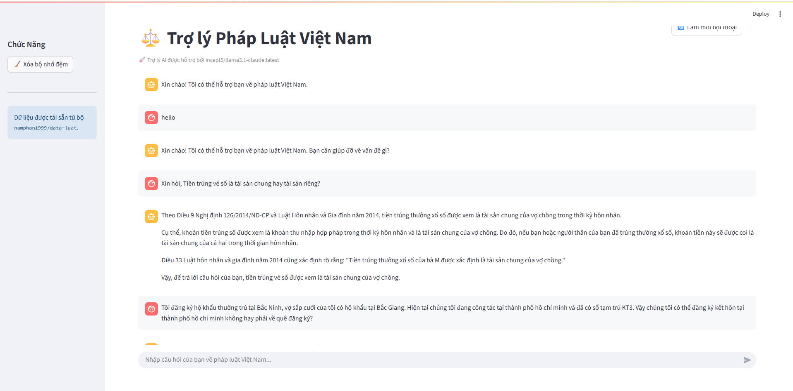

# ⚖️ Chatbot Tư Vấn Pháp Lý Việt Nam (RAG)
Trợ lý AI có vai trò như một luật sư giúp tư vấn các vấn đề liên quan đến pháp luật Việt Nam dựa trên tri thức được truy xuất (RAG). Hệ thống kết hợp FAISS (dense) + BM25 (sparse) + Cross-Encoder Reranker để chọn lọc ngữ cảnh, sinh đáp án bằng mô hình trên Ollama, và có bộ nhớ đệm (cache) tiết kiệm thời gian truy vấn.

## 📊 Kết quả



## 🎯 Tính năng
- **RAG Hybrid**: FAISS + BM25 (kết hợp bằng EnsembleRetriever).
- **Reranking**: `BAAI/bge-reranker-base` tăng chất lượng kết quả truy xuất.
- **LLM (Ollama)**: gọi mô hình từ Ollama server (ví dụ `incept5/llama3.1-claude:latest`).
- **Dữ liệu**: tự động tải bộ `namphan1999/data-luat` (Hugging Face datasets).
- **UI**: Streamlit, chat realtime, xóa cache, làm mới cuộc hội thoại.
- **Cache**:
  - Cache tài nguyên nặng: CrossEncoder và dataset dùng `st.cache_resource` (tránh tải lại mỗi rerun).
  - Cache câu trả lời: lưu JSON và tìm tương đồng ngữ nghĩa để tái sử dụng.

## 🧱 Cấu trúc thư mục

```
├── main.py                                 # Ứng dụng Streamlit (UI + luồng chat)
├── requirements.txt                        # Thư viện cần cài đặt
├── chunks_data/
│ └── load_data.py                          # Tải bộ 'namphan1999/data-luat'
├── retriever/
│ └── retriever.py                          # FAISS + BM25 → EnsembleRetriever
├── rerank/
│ └── reranker.py                           # CrossEncoderReranker (bge-reranker-base) + cache model
├── models/
│ ├── embedder.py                           # Embeddings cho Vector DB (Ollama) + HF cho cache
│ └── llm.py                                # Kết nối Ollama + hàm sinh trả lời (stream)
├── cache_communicate/
│ └── caching_communicate.py                # Cache kết quả Q&A bằng tương đồng cosine
└── create_suggestions/                     # (tùy chọn) sinh gợi ý tiếp theo (hiện đang để mẫu)
```

## 🛠️ Cài đặt

Yêu cầu:
- Đã cài và chạy Ollama: `ollama serve`
- Đã pull model phù hợp, ví dụ:
  - `ollama pull incept5/llama3.1-claude:latest`
  - `ollama pull embeddinggemma:300m` nếu dùng cho vector DB

Cài thư viện:
```bash
pip install -r requirements.txt
```

Nếu cần CUDA cho PyTorch, vui lòng cài theo hướng dẫn chính thức của PyTorch tương ứng GPU/CUDA của bạn.

## 🚀 Chạy ứng dụng

```bash
streamlit run main.py
```

Mở giao diện:
- Dùng nút "Xóa bộ nhớ đệm" để dọn cache trả lời.
- Dùng nút "Làm mới hội thoại" để bắt đầu một cuộc trò chuyện mới.

## ❓ Lỗi thường gặp & khắc phục

- Ollama không phản hồi:
  - Kiểm tra `ollama serve` đang chạy.
  - Kiểm tra đã `ollama pull` đúng tên model.
  - Mặc định `base_url="http://localhost:11434"`.

- Tải model reranker chậm mỗi lần rerun:
  - Đã được cache bằng `@st.cache_resource`. Nếu vẫn chậm, kiểm tra đường truyền khi lần đầu tải model từ Hugging Face.

## 📄 Bản quyền & Liên hệ
- Mục đích học tập/nghiên cứu.
- Dataset: `namphan1999/data-luat` (Hugging Face).
- Liên hệ: `nguyenphuongv07@gmail.com`.
